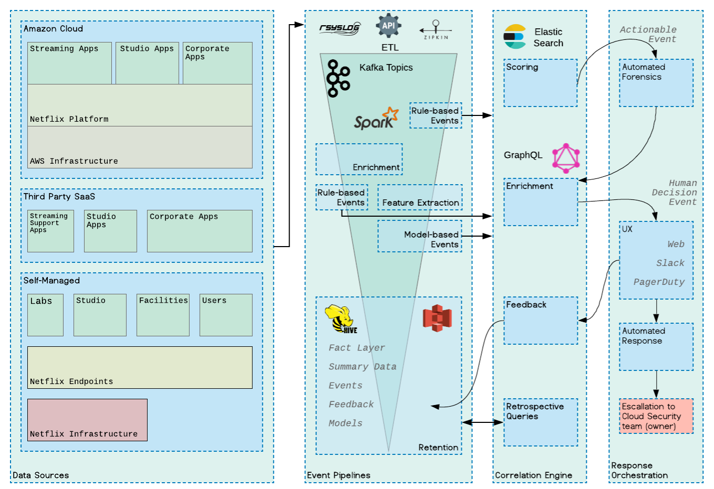
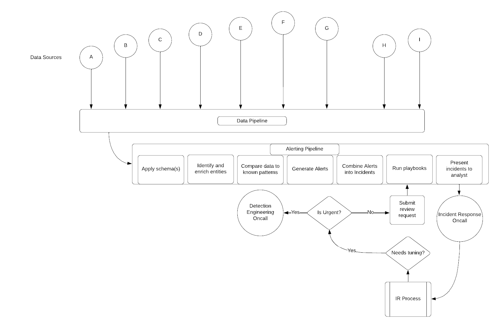
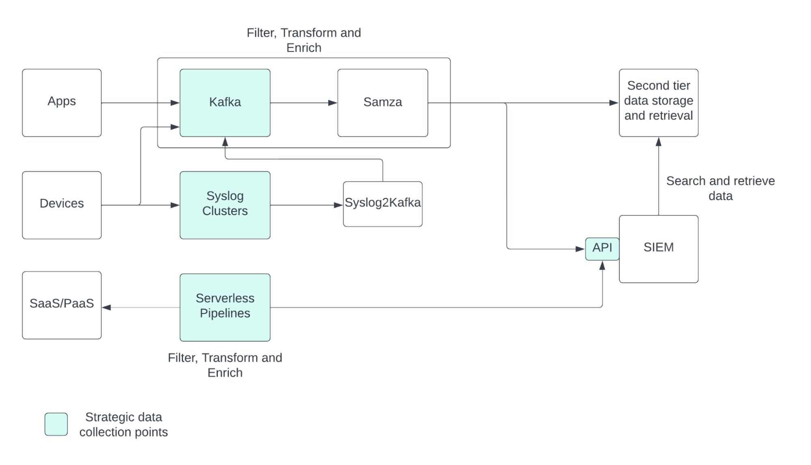
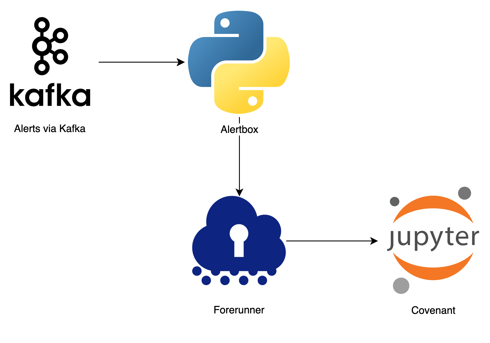
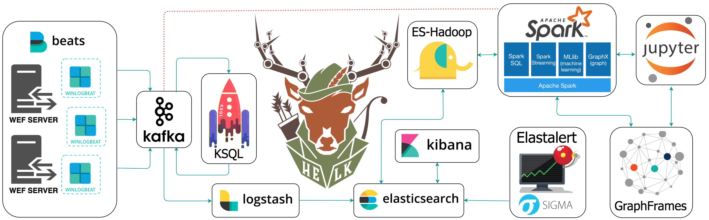
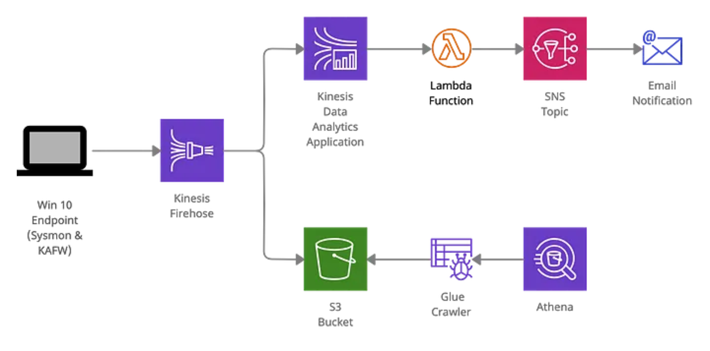

# Detection and Response Pipeline
✨ A compilation of suggested tools for each component in a detection and response pipeline, along with real-world examples. The purpose is to create a reference hub for designing effective threat detection and response pipelines. 👷 🏗

Join us, explore the curated content, and contribute to this collaborative effort.

## Contents

Main Components of a Detection & Response Pipeline:

  0. 📦 [Detection-as-Code Pipeline](#detection-as-code-pipeline)
  1. 🪵 [Data Pipeline](#data-pipeline)
  2. ⚠️ [Detection and Correlation Engine](#detection-and-correlation-engine)
  3. ⚙️ [Response Orchestration and Automation](#response-orchestration-and-automation)
  4. 🔍 [Investigation and Case Management](#investigation-and-case-management)

💡 [Real-world Examples](#real-world-examples)

📑 [Additional Resources](#additional-resources)

## Detection-as-Code Pipeline

| Tool / Service | Purpose |
|---|---|
| GitHub | Detection content development |
| GitLab | Detection content development |
| Gitea | Detection content development |
| AWS CodeCommit | Detection content development |
| GitHub Actions | CI/CD pipeline |
| GitLab Runner | CI/CD pipeline |
| Drone | CI/CD pipeline |
| AWS CodePipeline | CI/CD pipeline |
| AnviLogic | Detection content development, CI/CD pipeline, investigation and case management |

### Resources

- [Automating Detection-as-Code](https://www.tines.com/blog/automating-detection-as-code): An example reference that uses GitHub for detection content development, GitHub Actions for CI/CD, Elastic as SIEM, GitHub Issues for alert management, and Tines for alert and response handling.
- [Practical Detection-as-Code](https://www.infosecb.com/threat/detection/2021/11/21/detection-as-code.html): An example Detection-as-Code pipeline implementation using Sigma rules, GitLab CI/CD, and Splunk.
- CI/CD Detection Engineering ([part 1](https://www.splunk.com/en_us/blog/security/ci-cd-detection-engineering-splunk-security-content-part-1.html), [part 2](https://www.splunk.com/en_us/blog/security/ci-cd-detection-engineering-splunk-s-attack-range-part-2.html), [part 3](https://www.splunk.com/en_us/blog/security/ci-cd-detection-engineering-failing-part-3.html), [part 4](https://www.splunk.com/en_us/blog/security/ci-cd-detection-engineering-dockerizing-for-scale-part-4.html)): An example CI/CD detection engineering workflow in a Splunk environment.

## Data Pipeline

| Tool / Service | Purpose |
|---|---|
| [Tarsal](https://tarsal.co) | Log collection and transformation |
| [Vector](https://github.com/vectordotdev/vector) | Log collection and transformation |
| [Tenzir](https://github.com/tenzir/tenzir) | Log collection and transformation |
| [Fluent Bit](https://github.com/fluent/fluent-bit) | Log collection and transformation |
| [Cribl Stream](https://cribl.io/) | Log collection and transformation |
| [Airbyte](https://github.com/airbytehq/airbyte) | Log collection and transformation |
| [Logstash](https://github.com/elastic/logstash) | Log collection and transformation |
| [Kafka](https://kafka.apache.org/) | Stream processing |
| [Amazon Kinesis Data Streams](https://aws.amazon.com/kinesis/data-streams) | Stream processing |
| [Google Cloud DataFlow](https://cloud.google.com/dataflow) | Stream and batch processing |
| [Databricks](https://www.databricks.com/) | Stream and batch processing |
| [Apache Spark](https://spark.apache.org/) | Stream and batch processing |
| [Apache Flink](https://flink.apache.org/) | Stream and batch processing |
| [Apache NiFi](https://nifi.apache.org/) | Stream and batch processing |
| [Apache Beam](https://beam.apache.org/) | Stream and batch processing |
| [Faust](https://faust.readthedocs.io/en/latest/) | Stream and batch processing |

## Detection and Correlation Engine

In addition to the stream and batch processing tools mentioned in the [data pipeline](#data-pipeline) section, the following tools can be used for data analysis and detection.

| Tool / Service | Description |
|---|---|
| [Elasticsearch](https://github.com/elastic/elasticsearch) | with [ElastAlert2](https://github.com/jertel/elastalert2) or Elastic $ecurity |
| [OpenSearch](https://github.com/opensearch-project/OpenSearch) | with [ElastAlert2](https://github.com/jertel/elastalert2) or [OpenSearch Alerting](https://github.com/opensearch-project/alerting) |
| [Amazon Kinesis Data Analytics](https://aws.amazon.com/kinesis/data-analytics/) | Streaming data analysis in real time using Apache Flink |
| [Matano](https://github.com/matanolabs/matano) | Open source security lake platform for AWS |
| [ksqlDB](https://github.com/confluentinc/ksql) | SQL-Based Streaming for Kafka |
| [StreamAlert](https://github.com/airbnb/streamalert) | Real-time data analysis and alerting framework |

## Response Orchestration and Automation

| Tool / Service | Description |
|---|---|
| [Shuffler](https://github.com/Shuffle/Shuffle) | A general purpose security automation platform |
| [Torq](https://www.torq.io/) | No-code hyperautomation for security workflows |
| [Tines](https://www.tines.com/) | No-code automation for security workflows |

## Investigation and Case Management

* [GitHub](https://www.github.com)
* [DFIR IRIS](https://dfir-iris.org): Open-Source Collaborative Incident Response Platform
* [TheHive](https://github.com/TheHive-Project/TheHive): Open Source and Free Security Incident Response Platform
* [Torq Case Management](https://torq.io/blog/hyperautomation-case-management/)
* [Tines Cases](https://www.tines.com/product/cases)

### Resources:
- [Using Github For Automated Case Management](https://www.youtube.com/watch?v=PqMI6euJS7s): Material Security's presentation on how its security team is automating case management using GitHub and Tines.

## Real-world Examples

Please note that this information is extracted from public blog posts and conference talks, and may not be comprehensive or reflect the current state of the companies' pipelines. Some examples may focus on specific components, such as the correlation engine, rather than covering the entire pipeline. These examples are intended as starting points, so please view them as informative rather than definitive solutions.

If you have additional information or insights about any of the examples included here and **have permission to share** them, we encourage you to contribute by sending a pull request to enhance or add more details.

| # | Technologies / Components | Note | References |
|---|---|---|---|
| 0 | • Databricks  • Apache Spark  • Delta Lake  • Scala | _"Apple must detect a wide variety of security threats, and rises to the challenge using Apache Spark across a diverse pool of telemetry. Some of the home-grown solutions we’ve built to address complications of scale:  1. **Notebook-based testing CI** – Previously we had a hybrid development model for Structured Streaming jobs wherein most code would be written and tested inside of notebooks, but unit tests required export of the notebook into a user’s IDE along with JSON sample files to be executed by a local SparkSession. We’ve deployed a novel CI solution leveraging the Databricks Jobs API that executes the notebooks on a real cluster using sample files in DBFS. When coupled with our new test-generation library, we’ve seen 2/3 reduction in the amount of time required for testing and 85% less LoC.  2. **Self-Tuning Alerts** – Apple has a team of security analysts triaging the alerts generated by our detection rules. They annotate them as either ‘False Positive’ or ‘True Positive’ following the results of their analysis. We’ve incorporated this feedback into our Structured Streaming pipeline, so the system automatically learns from consensus and adjusts future behavior. This helps us amplify the signal from the rest of the noise.  3. **Automated Investigations** – There are some standard questions an analyst might ask when triaging an alert, like: what does this system usually do, where is it, and who uses it? Using ODBC and the Workspace API, we’ve been able to templatize many investigations and in some cases automate the entire process up to and including incident containment.  4. **DetectionKit** – We’ve written a custom SDK to formalize the configuration and testing of jobs, including some interesting features such as modular pre/post processor transform functions, and a stream-compatible exclusion mechanism using foreach Batch."_ | 1. [Scaling Security Threat Detection with Apache Spark and Databricks](https://www.youtube.com/watch?v=YxTE4mff5dk) by Josh Gillner (Apple Detection Engineering)   2. [Threat Detection and Response at Scale](https://www.youtube.com/watch?v=SFeBJxI4Q98) by Dominque Brezinski (Apple) |
| 1 | • Kafka  • Apache Spark  • Apache Hive  • Elasticsearch • GraphQL • Amazon S3 • Slack • PagerDuty |  | [A SOCless Detection Team at Netflix](https://www.linkedin.com/pulse/socless-detection-team-netflix-alex-maestretti/) by Alex Maestretti (Netflix) |
| 2 | • Kafka  • [Apache Samza](https://samza.apache.org/)  • Microsoft Sentinel?  • [KQL](https://learn.microsoft.com/en-us/azure/data-explorer/kusto/query/)  • Azure Pipelines and Repos for CI/CD pipeline  • Jira  • ServiceNow  • Serverless functions | *high-level strategy*     *Simplified data collection pipeline*   | [(Re)building Threat Detection and Incident Response at LinkedIn](https://engineering.linkedin.com/blog/2022/-re-building-threat-detection-and-incident-response-at-linkedin) by Sagar Shah and Jeff Bollinger (Linkedin) |
| 3  | • [go-audit](https://github.com/slackhq/go-audit)  • Elasticsearch  • [ElastAlert](https://github.com/Yelp/elastalert)[0] | _"We send the events to an Elasticsearch cluster. From there we use ElastAlert to query our incoming data continuously for alert generation and general monitoring."_  | [Syscall Auditing at Scale](https://slack.engineering/syscall-auditing-at-scale/) by Ryan Huber (Slack)  |
| 4 | • Kafka   • Jupyter notebook   • Python   • osquery, Santa, and OpenBSM/Audit for MacOS monitoring | _"Alertbox was the first project we built to start cutting down on our triage time. The goal was to move our alert response runbooks into code, and have them execute before we even begin the triage process.   Think of Forerunner as the glue between Alertbox and Covenant. When an alert fires, Alertbox calls out a RPC service called Forerunner. This service returns a Jupyter notebook corresponding to the alert. Alertbox then embeds the URL of this Jupyter notebook into the alert ticket. In the background, Forerunner also runs this alert notebook asynchronously."_    | 1. [How Dropbox Security builds tools for threat detection and incident response](https://dropbox.tech/security/how-dropbox-security-builds-better-tools-for-threat-detection-and-incident-response) by Dropbox DART   2. [MacOS monitoring the open source way](https://dropbox.tech/security/macos-monitoring-the-open-source-way) by Michael George (Dropbox)   3. [OLD] [Meet Securitybot: Open Sourcing Automated Security at Scale](https://dropbox.tech/security/meet-securitybot-open-sourcing-automated-security-at-scale) by Alex Bertsch (Dropbox) and [Distributed Security Alerting](https://slack.engineering/distributed-security-alerting/) by Ryan Huber (Slack) |
| 5 | • [StreamAlert](https://github.com/airbnb/streamalert) • [BinaryAlert](https://github.com/airbnb/binaryalert)  | - _"StreamAlert is a serverless, real-time data analysis framework which empowers you to ingest, analyze, and alert on data from any environment, using data sources and alerting logic you define. Computer security teams use StreamAlert to scan terabytes of log data every day for incident detection and response."_ - _"BinaryAlert is an open-source serverless AWS pipeline where any file uploaded to an S3 bucket is immediately scanned with a configurable set of YARA rules. An alert will fire as soon as any match is found, giving an incident response team the ability to quickly contain the threat before it spreads."_ | 1. [StreamAlert: Real-time Data Analysis and Alerting](https://medium.com/airbnb-engineering/streamalert-real-time-data-analysis-and-alerting-e8619e3e5043) by Airbnb Eng   2. [BinaryAlert: Real-time Serverless Malware Detection](https://medium.com/airbnb-engineering/binaryalert-real-time-serverless-malware-detection-ca44370c1b90) by Austin Byers (Airbnb)
| 6 | • ELK stack   • Kafka   • [KSQL](https://github.com/confluentinc/ksql)   • [ES-Hadoop](https://github.com/elastic/elasticsearch-hadoop)   • ElastAlert[0]   • Apache Spark   • Jupyter notebook   • GraphFrames  | _"The Hunting ELK or simply the HELK is one of the first open source hunt platforms with advanced analytics capabilities such as SQL declarative language, graphing, structured streaming, and even machine learning via Jupyter notebooks and Apache Spark over an ELK stack. This project was developed primarily for research, but due to its flexible design and core components, it can be deployed in larger environments with the right configurations and scalable infrastructure."_    | [The Hunting ELK](https://github.com/Cyb3rWard0g/HELK) project by Roberto Rodriguez |
| 7 | • AWS Kinesis Firehose   • AWS Kinesis Data Analytics Application   • AWS Lambda   • AWS S3   • AWS Athena   • AWS Simple Notification Services  | _"In this example, various AWS serverless application services are used together to create a detection pipeline that is capable of near-realtime detection. The pipeline requires no administrative overhead of servers or container infrastructure, enabling a detection and response team to focus on threat detection capabilities."_    | [Building a Serverless Detection Platform in AWS Pt. I: Endpoint Detection](https://infosecb.medium.com/building-a-serverless-detection-platform-in-aws-pt-i-endpoint-detection-1a0e34d9c28c) by Brendan Chamberlain |

0. ElastAlert is no longer maintained. You can use [ElastAlert2](https://github.com/jertel/elastalert2) instead.

## Additional Resources

- [Awesome Threat Detection and Hunting](https://github.com/0x4D31/awesome-threat-detection): A curated list of awesome threat detection and hunting resources.
- [Awesome Detection Engineering](https://github.com/infosecB/awesome-detection-engineering): A list of useful Detection Engineering-related resources.

## License

To the extent possible under law, Adel "0x4D31" Karimi has waived all copyright and related or neighboring rights to this work.
